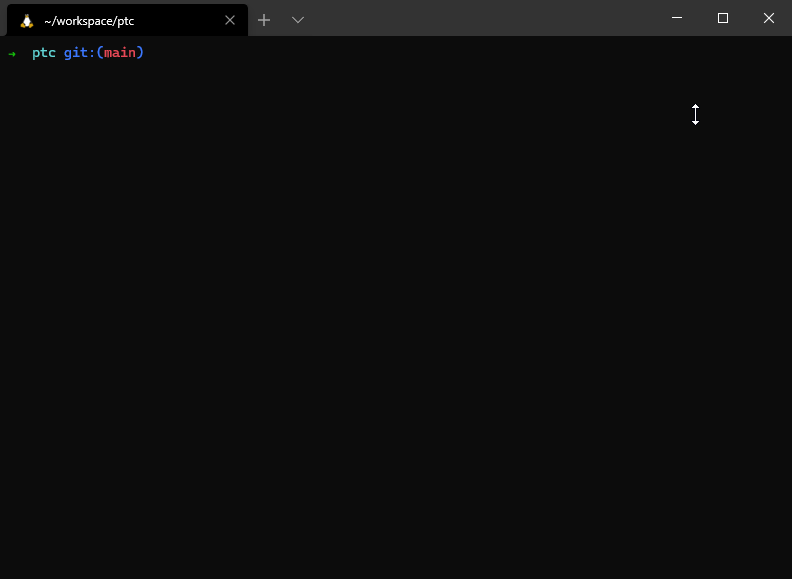
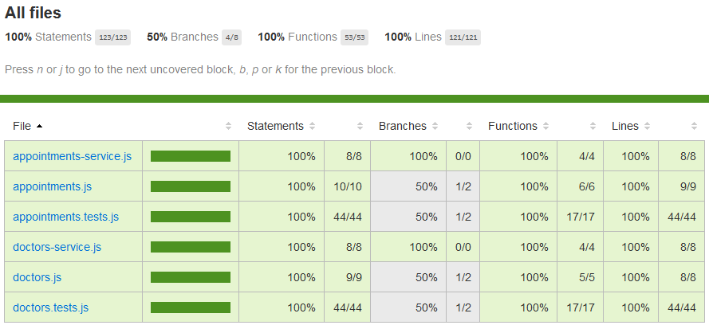

# Phlo Tech Challenge (Adi Laiman)
## 1 TODOS

### 1.1 Specifications
- [x] The user can view doctors near to them.
- [x] The user's location (lat/long) should be captured by the app.
- [x] The user's captured location should be used to retrieve a collection of doctors nearby. Google Places API or another appropriate data source should be
used.
- [x] The user's location and the locations of the nearby doctors are plotted on a map.
- [x] The user can book an appointment at one of the nearby doctors.
- [x] On selecting a doctor on the map, the user is presented with an appointment booking form which requires them to enter their name, email address and
preferred appointment time.
- [x] On submitting the booking form a successful booking confirmation message is shown.

---
## 2 How to deploy on a local machine

### 2.1 Installing Meteor
```BASH
https://www.meteor.com/

<Install instructions from the Meteor website>
<MacOS/Linux>
curl https://install.meteor.com/ | sh

<Windows>
<1 Install Chocolatey>
https://chocolatey.org/install

<2 Install Meteor via Choco>
choco install meteor
```

### 2.2 Running Meteor
```BASH
Before running the app, make sure to add your Google Maps API key in the file located
client/main.html

The key needs to be placed in the script indicated by
<YOUR_API_KEY>

cd <cloned repo folder>
meteor npm install
meteor

If you still get package errors after running these commands you will need to run
meteor npm rebuild
```


### 2.3 Run MochaJS unit tests
```BASH
meteor test --driver-package meteortesting:mocha --full-app
```


### 2.4 Run Meteor Mocha Code Coverage
```BASH
meteor npm install --save-dev babel-plugin-istanbul

BABEL_ENV=COVERAGE COVERAGE=1 COVERAGE_VERBOSE=1 COVERAGE_APP_FOLDER=$PWD/ TEST_WATCH=1 meteor test --driver-package meteortesting:mocha

http://localhost:3000/coverage
```

If you do not see any green on the code coverage page, please refresh the page, as code coverage takes a small amount of time to load before generating an up to date html document.



### 2.5 Demo


## 3 Epilogue
### 3.1 Post Challenge Footnotes
Fun challenge! However since I do not have any time other than the weekends, I have hacked this up during these 2 days. Other than unit tests the app has not been thouroughly tested and it's my first time using MaterializeCSS, so some bugs 🐛 are bound to appear!

### 3.2 Improvements
Listed below are a list of improvements I would make, if this was a full time project.
- [ ] Check marker validity, some markers do not work because data isn't returned from the API
- [ ] Implement a way to make clusters of markers more visible and easier to select
- [ ] Implement a user account system with pagination for the appointments page
- [ ] Use Bootstrap 😂, from this experiment with MaterializeCSS, there's less tools such as multiple modals which Bootstrap has. Furthermore, some of the default responsive design is bugged in my app.
- [ ] Design a proper schema for the collections